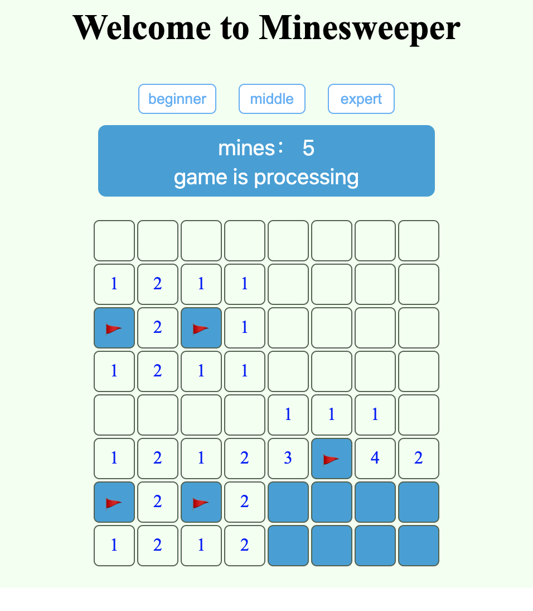

# Minesweeper-game 扫雷小游戏

## 概述
    通过创建Minesweeper-game游戏来熟悉React的使用

## 游戏规则
 *  游戏共分为三个等级，分别为beginner，middle，expert，用户可以通过点击按钮选择不同的难度等级；
 *  点击单元格，若为地雷则游戏结束，否则显示该单元格上，下，左，右，左上，左下，右上，右下八个单元格的地雷总数；
 *  右击单元格进行地雷标记，以及标记取消；
 *  游戏获胜的条件：
    *  若未点击单元格总数等于地雷总数则游戏获胜；
    *   若标记单元格个数等于地雷总数，且标记都正确，则游戏获胜；

## 项目安装部署
### Install
   > npm install
### Start Server
   > npm start
   It's served in [http://localhost:3000](http://localhost:3000/)
## 点击链接，试玩游戏
   > [试玩链接](https://minesweeper.hi-hi.cn/)

